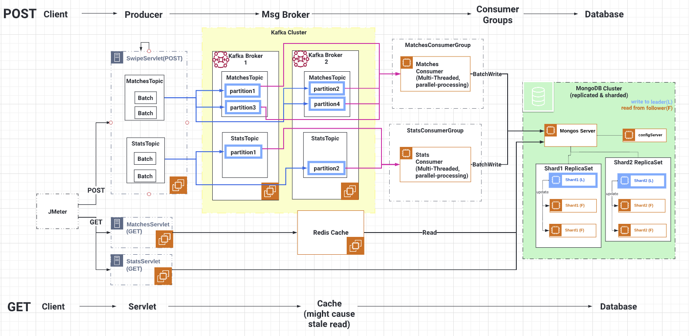

# Twinder - A Distributed Systems Service
> Twinder is a revolutionary gender-free dating service built on advanced technologies and a scalable distributed system architecture and Twinder provides a seamless and efficient dating platform. This app supports swipe events for users and stores information such as potential matches and the number of likes and dislikes.
> Live demo [_here_](https://docs.google.com/presentation/d/1hFm6TPAzC2Zw7cwiCJnpDvBH_1iI77Kl8chhuudVlHo/edit#slide=id.g219bc6154e0_0_115). 

## Table of Contents
* [General Info](#general-information)
* [Technologies Used](#technologies-used)
* [Screenshots](#screenshots)
* [Room for Improvement](#room-for-improvement)
* [Acknowledgements](#acknowledgements)
* [License](#license)

## General Information
At the core of Twinder is a RESTful service that we have meticulously designed using the CQRS pattern. This service efficiently handles user swipes, optimizes matches, and seamlessly facilitates communication between users. With our expertise in load balancing, RabbitMQ, Kafka, and Redis, Twinder ensures efficient scaling and enables asynchronous messaging.

To handle the high volumes of user data, we have implemented distributed databases, including MongoDB Shard Cluster. Additionally, we leverage the power of Redis to ensure fast retrieval of frequently accessed information. By optimizing various components such as multi-threading, fine-tuning the Tomcat Server, and optimizing Kafka partitions, we have significantly enhanced Twinder's performance.

For deployment, we have chosen the reliable infrastructure of AWS EC2, complemented by load balancing mechanisms. This setup guarantees fault tolerance and scalability as the user base grows. Through rigorous stress testing and meticulous fine-tuning of our system's components and configurations, we have achieved an impressive throughput, enabling Twinder to handle a large number of requests per second.

## Technologies Used
- CQRS (Command Query Responsibility Segregation): Ensures scalability, maintainability, and efficient data processing in Twinder's RESTful service
- Load Balancing: Distributes incoming requests across multiple servers to prevent bottlenecks and ensure responsiveness
- RabbitMQ and Kafka: Asynchronous messaging protocols that enable efficient communication between system components
- MongoDB Shard Cluster: Distributed databases that accommodate high volumes of user data in a scalable manner
- Redis: High-performance in-memory data store used for caching and fast retrieval of frequently accessed information
- Optimization Techniques: Multi-threading, Tomcat Server tuning, and Kafka partition optimization for enhanced system performance
- AWS EC2: Deployment on the Amazon Web Services infrastructure, leveraging load balancing mechanisms for fault tolerance and scalability
- Stress Testing: Rigorous testing to evaluate and optimize system performance, achieving high throughput

## Screenshots

<!-- If you have screenshots you'd like to share, include them here. -->

## Room for Improvement

Room for improvement:
- Improvement to be done 1
- Improvement to be done 2

To do:
- Feature to be added 1
- Feature to be added 2

## Acknowledgements
- The project drew inspiration and guidance from various resources, including online tutorials, research papers, and discussions within the development community.
- We would like to express our gratitude to the authors and contributors of the resources and tutorials that provided valuable insights and helped shape the development of Twinder.
- Many thanks to Cindy and other team members who dedicated their time and expertise to bring this project to life, contributing their skills in software development, system architecture, and design.
- Special thanks to professor Gorton who provided feedback and insights throughout the development process, helping us refine and improve Twinder to meet the needs and expectations of our assignment requirement.

## License
This project is open source and available under the [MIT License](https://opensource.org/licenses/MIT).
